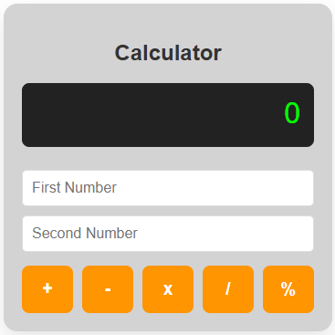
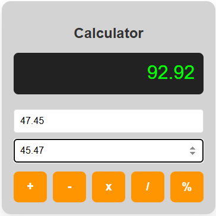
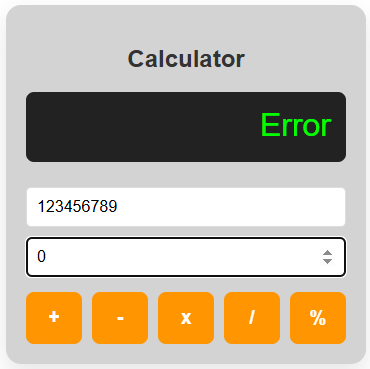
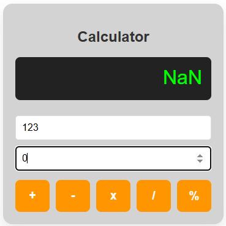

# 🔢 Simple Calculator using JSP and Servlet


A web-based calculator built using **Java Servlets**, **JSP**, and **Apache Tomcat**. The project demonstrates the **Model-View-Controller (MVC)** architecture by separating the presentation layer from the business logic, with JSP handling the user interface and Servlets processing requests.

---

## ✨ Features

- Perform basic arithmetic operations:
  - Addition
  - Subtraction
  - Multiplication
  - Division
  - Modulus
- Supports integer and decimal calculations
- Handles division by zero and invalid inputs
- Responsive calculator interface using CSS Grid
- Uses `RequestDispatcher` for server-side request forwarding
- Demonstrates MVC architecture with JSP and Servlets

---

## 🛠️ Tech Stack

| Category | Technology |
|----------|------------|
| Language | Java 8 |
| Backend | Java Servlet 4.0 |
| View Technology | JSP |
| Frontend | HTML5, CSS3 |
| Web Server | Apache Tomcat 9 |
| IDE | Eclipse / Spring Tool Suite (STS) |

---

## 📁 Project Structure

```text
SimpleCalculator-Using-JSPServlet/
├── src/
│   └── main/
│       ├── java/
│       │   └── com.Calc/
│       │       └── CalcServ1.java
│       └── webapp/
│           ├── Calculator.jsp
│           └── WEB-INF/
│               └── web.xml
└── README.md
```

---

## 🔄 Request Flow

```text
     Browser
        │
        ▼
  Calculator.jsp
        │
        ▼
CalcServ1 (Servlet)
        │
Performs Calculation
        │
        ▼
 RequestDispatcher
        │
        ▼
  Calculator.jsp
        │
 Displays Result
```

---

## 🧠 Concepts Demonstrated

- Java Servlet fundamentals
- JSP as the presentation layer
- MVC architecture
- Request forwarding using `RequestDispatcher`
- Form handling with Servlets
- Input validation and exception handling
- Dynamic content rendering with JSP

---

## ⚙️ Getting Started

### Prerequisites

- Java 8 or higher
- Apache Tomcat 9
- Eclipse or Spring Tool Suite (STS)

### Clone the Repository

```bash
git clone https://github.com/Atharva-Shelke/SimpleCalculator-Using-JSPServlet.git
```

### Run the Application

1. Import the project into Eclipse or STS as a **Dynamic Web Project**.
2. Configure Apache Tomcat 9 as the target runtime.
3. Right-click the project and select **Run As → Run on Server**.
4. Open the application:

```text
http://localhost:8080/SimpleCalculator-Using-JSPServlet/
```

---

## 📸 Screenshots

### Calculator Interface



### Calculation Result



### Division By zer0



### Modulus By zer0



---

## 📚 What I Learned

- Building web applications with JSP and Servlets
- Implementing the MVC design pattern
- Processing form data in Servlets
- Server-side request forwarding
- Exception handling in Java web applications
- Deploying WAR applications on Apache Tomcat
